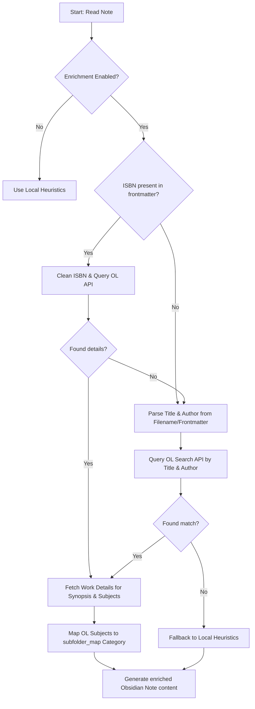

# Architectural Blueprint: ISBN & Book Metadata Enrichment

This document provides a complete, step-by-step technical blueprint and design specification for the developer agent to implement the **ISBN & Open Library Book Enrichment** feature in `FixObsidian`.

---

## System Overview



---

## Technical Specifications

### 1. The Caching Layer (`data/metadata_cache.json`)
To stay rate-limit friendly, you must implement a cache manager class or functions:
* **Storage format:** A JSON dictionary where the key is the cleaned ISBN or the normalized `"title - author"`, and the value is the cached JSON metadata dictionary.
* **Behavior:**
  * If a lookup is requested, always search the cache first.
  * If found, return instantly.
  * If not found and it's a `dry-run`, **do not** make live API requests; instead, return empty results.
  * If not found during a live run, query the API, wait `0.5` seconds to prevent rate limits, and save the result back to `data/metadata_cache.json`.

---

### 2. The API Connector Pipeline
Implement the following network request pipeline using `urllib.request` (standard library, keeps the tool zero-dependency):

#### Step A: Clean ISBN
Strip all non-alphanumeric characters:
```python
clean_isbn = re.sub(r'[^0-9Xx]', '', raw_isbn)
```

#### Step B: Query ISBN API
Request `https://openlibrary.org/api/books?bibkeys=ISBN:{isbn}&format=json&jscmd=data`.
* Parse the JSON. It will return a dictionary like `{"ISBN:<isbn>": { ... }}`.
* Extract `title`, `publish_date`, `publishers`, `subjects`, and if there's a link under `"works"`, extract the key (e.g. `/works/OLxxxxxW`).

#### Step C: Fallback to Search API (ISBN / Title & Author)
If Step B yields nothing, query:
* `https://openlibrary.org/search.json?isbn={isbn}` OR
* `https://openlibrary.org/search.json?title={title}&author={author}` (URL-encoded).
* Grab the first result in `"docs"`:
  * Extract `first_publish_year` as `publish_date`.
  * Extract `"key"` (e.g. `/works/OLxxxxxW`) as the work key.

#### Step D: Fetch Work Details for Synopsis & Subjects
If you have a work key (e.g., `/works/OLxxxxxW`), query:
* `https://openlibrary.org/works/{work_id}.json`.
* Extract:
  * `"description"` (can be a string or a dict like `{"value": "..."}`).
  * `"subjects"` (a list of strings representing book genres).

---

### 3. Subject-to-Genre Mapping
Cross-reference the fetched `subjects` list with the keywords in your `config.json` `subfolder_map`:
* Loop through each subject keyword.
* If a keyword from `subfolder_map` matches any part of a subject (case-insensitively), map the book to that genre.
* **Example:** Subject contains `"Science fiction"` $\rightarrow$ maps keyword `"science fiction"` in `03 Science Fiction`.

---

### 4. Template Enrichment (`core/vortexy_obsidian.py`)
Modify `make_obsidian_content()` to accept optional parameters:
* `publisher` (frontmatter: `publisher: "{publisher}"`)
* `publish_date` (frontmatter: `publish_date: "{publish_date}"`)
* `synopsis` (body callout block):
  ```markdown
  > [!info] Synopsis
  > {synopsis}
  ```

---

### 5. CLI Flags (`tools/fix_obsidian_notes.py`)
Add two arguments to the `argparse` configuration in `main()`:
* `--enrich` (stores `True`): Activates the Open Library API metadata lookup.
* `--clear-cache` (stores `True`): Clears the `data/metadata_cache.json` before processing.
